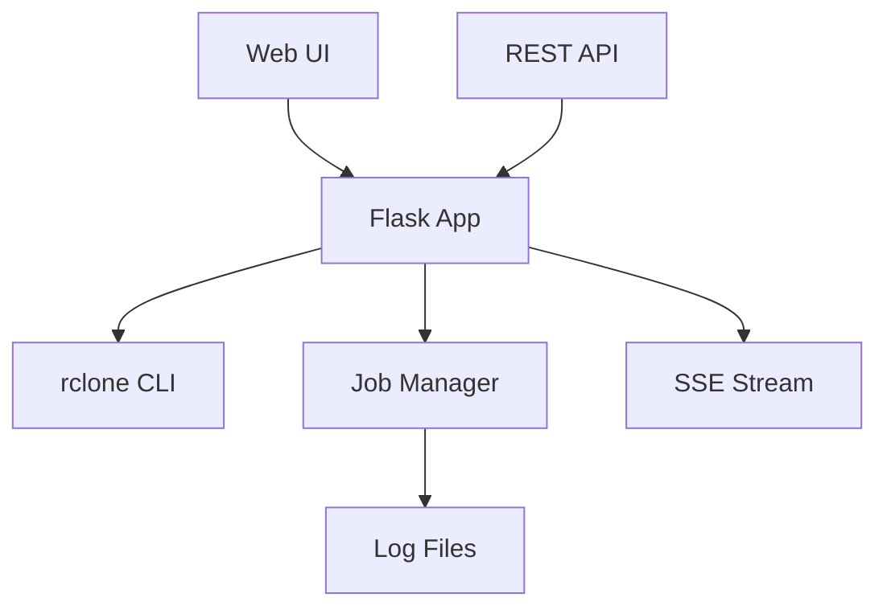

# 🔄 Cloud Storage Sync

Applicazione web professionale per la sincronizzazione multi-cloud di storage utilizzando **rclone** come backend. Supporta interfaccia web intuitiva e API REST complete per automazione.

<div align="center">


**Provider Supportati:** GCS • ECS • S3 • 

</div>

---

## 📋 Indice

- [✨ Features](#-features)
- [📋 Requisiti](#-requisiti)
- [⚡ Quick Start](#-quick-start)
- [📁 Struttura Progetto](#-struttura-progetto)
- [👥 Manuale Utente](#-manuale-utente)
- [💻 Manuale Sviluppatore](#-manuale-sviluppatore)
- [🔌 API Reference](#-api-reference)
- [📚 Use Cases](#-use-cases)
- [🔧 Troubleshooting](#-troubleshooting)
- [🤝 Contributi](#-contributi)

---

## ✨ Features

### 🌐 **Interfaccia Web Moderna**
- **Design responsive** ottimizzato per desktop e mobile
- **Real-time monitoring** dei job di sincronizzazione
- **Gestione credenziali** sicura per diversi provider
- **Upload file JSON** drag-and-drop per Service Account
- **Console output** live con streaming log

### 🔗 **Multi-Provider Support**
- **Google Cloud Storage (GCS)**: HMAC + Service Account
- **Elastic Cloud Storage (ECS)**: S3-compatible
- **Amazon S3**: Standard e compatibili
- **MinIO**: Self-hosted storage
- **Cloudflare R2**: Edge storage

### 🔧 **Autenticazione Flessibile**
- **HMAC**: Access Key + Secret Key
- **Service Account**: File JSON o testo (GCS)
- **Project Number**: Supporto automatico per GCS
- **Environment isolation**: Credenziali sicure per job

### 🚀 **API REST Complete**
- **Job management**: Creazione, monitoring, listing
- **Server-Sent Events**: Stream real-time dei log
- **JSON API**: Integrabile in workflow esistenti
- **Automazione**: Supporto completo per scripting

---

## 📋 Requisiti

### **Sistema**
- **Python**: 3.6 o superiore
- **rclone**: 1.50+ installato e configurabile
- **OS**: Linux, macOS, Windows (WSL supportato)

### **Python Dependencies**
```bash
flask>=2.0.0
python-dotenv>=0.19.0
flask-talisman
```

---

## ⚡ Quick Start

### **1️⃣ Clona e Installa**
```bash
cd /opt
git clone https://github.com/axxx75/s3cp.git
cd s3cp
python3 -m venv venv
source venv/bin/activate
pip install flask python-dotenv gunicorn flask-talisman
```

### **2️⃣ Configura rclone**
```bash
# Installa rclone se non presente
curl https://rclone.org/install.sh | bash

# Verifica installazione
rclone version
```

### **3️⃣ Avvia l'applicazione (installazione come service)**
```bash
cp s3cp-webapp.service /etc/systemd/system/
systemctl daemon-reload
systemctl enable s3cp-webapp
systemctl start s3cp-webapp

# Se vuoi il server in HTTPS scommenta le 2 righe nel file gunicorn.conf.py
Documentati bene su come farlo seriamente, eventualmente con una CA. Al volo puoi fare come segue, crea i file server.crt e server.key nella dir dell'app
 openssl req -x509 -newkey rsa:4096 -nodes -keyout app/server.key -out app/server.crt -days 365 -subj "/CN=localhost"

# Verifica start
journalctl -u s3cp-webapp.service -f
```

### **4️⃣ Accedi all'interfaccia**
```
🌐 http://localhost:8080
```

---

## 📁 Struttura Progetto

```
s3cputo/
├── 📄 start.sh                  # 🔧 Script per start application
├── 📄 gunicorn.conf.py          # 🔧 File conf server gunicorn
├── 📄 s3cp-webapp.service    # 🔧 Script for service configuration
├── 📄 README.md                 # 📖 Questo file
├── 📁 app/                      # 📁 Folder Application
│   └── 📁 static/               # 📁 Folder static content
│       └── 📄 custom.css        # 🎨 Styling dell'interfaccia web
│   └── 📁 templates/            # 📁 Folder template html
│       └── 📄 index.html        # 🌐 Single-page application UI
|   └── 📄 app.py                # 🔧 Main Flask application
|   └── 📄 config.py             # ⚙️ Provider configurations & flags

```

### **📄 File Principali**

| File | Scopo | Descrizione |
|------|-------|-------------|
| `app.py` | 🔧 **Backend** | Flask app, API endpoints, job management |
| `config.py` | ⚙️ **Configurazione** | Provider configs, rclone flags, paths |
| `index.html` | 🌐 **Frontend** | SPA con JavaScript per UI interattiva |
| `custom.css` | 🎨 **Styling** | Design moderno con glassmorphism |

---

## 👥 Manuale Utente

### **🌐 Interfaccia Web**

#### **1️⃣ Configurazione Source (Sorgente)**
1. **Seleziona Provider**: GCS, ECS, S3, etc.
2. **Inserisci Credenziali**:
   - **HMAC**: Access Key + Secret Key
   - **Service Account** (solo GCS): Upload JSON o incolla testo
3. **Carica Bucket**: Click su "Lista Bucket" per caricare bucket disponibili
4. **Seleziona Bucket** e opzionalmente un **Path**

#### **2️⃣ Configurazione Destination (Destinazione)**
- **Stessa procedura** del source
- **Può essere provider diverso** (es. GCS → ECS)

#### **3️⃣ Opzioni Avanzate (Facoltativo)**
Espandi la sezione "⚙️ Opzioni Avanzate" per:
- **Dry Run**: Simula sincronizzazione senza trasferire file
- **Verbose**: Log dettagliati
- **Progress**: Mostra progresso trasferimento
- **Fast List**: Ottimizzazione per bucket grandi
- **Custom flags**: Aggiungi flag rclone personalizzati

#### **4️⃣ Avvio Sincronizzazione**
1. **Click "🚀 Avvia Sincronizzazione"**
2. **Monitoring Real-time**: I log appaiono automaticamente nella console
3. **Completion**: Messaggio di completamento automatico

### **🔐 Gestione Credenziali**

#### **HMAC (Standard)**
```
Access Key: AKIA1234567890
Secret Key: wJalrXUtnFEMI/K7MDENG/bPxRfiCYEXAMPLEKEY
```

#### **GCS Service Account**
- **File Upload**: Drag & drop del file `.json`
- **Text Input**: Copia/incolla del contenuto JSON
- **Project Number**: Inserimento manualenprojectid (required)

---

## 💻 Manuale Sviluppatore

### **🏗️ Architettura**



### **🔧 Flask Application (`app.py`)**

#### **Core Functions**
- **`list_buckets()`**: Esegue `rclone lsd` per elencare bucket
- **`copy()`**: Lancia `rclone sync` in background con job ID
- **`stream_log()`**: Server-Sent Events per streaming log real-time
- **`jobs()`**: Lista tutti i job attivi/completati

#### **Job Management**
```python
# Job ID formato: YYYYMMDD_HHMMSS_randomstring
job_id = "{}_{}".format(timestamp, uuid.uuid4().hex[:6])

# Log file: /tmp/job_{job_id}.log
log_file = os.path.join(LOG_DIR, "job_{}.log".format(job_id))
```

#### **Environment Handling**
```python
def safe_env():
    """Crea environment isolato per rclone subprocess"""
    env = os.environ.copy()
    # Remove existing rclone env vars
    # Add job-specific credentials
    return env
```

### **⚙️ Configuration (`config.py`)**

#### **Provider Definitions**
```python
PROVIDERS = {
    "gcs": "Google Cloud Storage",
    "ecs": "Elastic Cloud Storage",
    "s3": "Amazon S3"
}
```

#### **Flag System**
```python
def get_provider_flags(provider):
    """Ritorna flag specifici per provider"""
    flags = GLOBAL_FLAGS.copy()
    if provider.lower() == 'gcs':
        flags.extend(['--gcs-bucket-policy-only'])
    return flags
```

### **🎨 Frontend (`index.html` + `custom.css`)**

#### **Architecture Pattern**
- **Single Page Application** (SPA)
- **Vanilla JavaScript** (no frameworks)
- **Event-driven** UI updates
- **CSS Grid + Flexbox** layout

#### **Key JavaScript Functions**
```javascript
// Provider change handler
function handleProviderChange(type) { /* ... */ }

// Credential validation
function getCredentials(type) { /* ... */ }

// Real-time log streaming
const eventSource = new EventSource('/api/log/' + jobId);
```

---

## 🔌 API Reference

### **📡 Endpoints**

| Method | Endpoint | Descrizione |
|--------|----------|-------------|
| `POST` | `/api/list_buckets` | Lista bucket di un provider |
| `POST` | `/api/copy` | Avvia job di sincronizzazione |
| `GET` | `/api/log/<job_id>` | Stream real-time log job (SSE) |
| `GET` | `/api/jobs` | Lista tutti i job |

---

### **1️⃣ Lista Bucket**

**Request:**
```bash
curl -X POST http://localhost:8081/api/list_buckets \
  -H "Content-Type: application/json" \
  -d '{
    "provider": "gcs",
    "creds": {
      "sa_credentials": "{\"type\":\"service_account\",\"project_id\":\"my-project\",...}",
      "gcs_project_number": "123456789"
    }
  }'
```

**Response:**
```json
{
  "buckets": [
    "my-production-bucket",
    "my-staging-bucket",
    "my-backup-bucket"
  ]
}
```

---

### **2️⃣ Avvia Sincronizzazione**

**Request:**
```bash
curl -X POST http://localhost:8081/api/copy \
  -H "Content-Type: application/json" \
  -d '{
    "src_provider": "gcs",
    "dst_provider": "ecs",
    "src_bucket": "source-bucket",
    "dst_bucket": "destination-bucket",
    "src_path": "data/2025/",
    "dst_path": "backup/gcs-migration/",
    "src_creds": {
      "auth_method": "sa",
      "sa_credentials": "{...}",
      "gcs_project_number": "123456789"
    },
    "dst_creds": {
      "access_key": "AKIA...",
      "secret_key": "wJal..."
    },
    "additional_flags": ["--verbose", "--progress", "--dry-run"]
  }'
```

**Response:**
```json
{
  "job_id": "20251013_232320_a7f3d2"
}
```

---

### **3️⃣ Monitoring Job**

**Request:**
```bash
curl -N http://localhost:8081/api/log/20251013_232320_a7f3d2
```

**Response (Server-Sent Events):**
```
data: [2025-10-13 23:23:20] Avvio sincronizzazione GCS → ECS
data: [2025-10-13 23:23:21] Validazione credenziali GCS...
data: [2025-10-13 23:23:22] Connessione a ECS stabilita
data: [2025-10-13 23:23:23] Scansione source: data/2025/ (1,247 file, 2.3GB)
data: [2025-10-13 23:23:45] Progresso: 45% (1.03GB trasferiti)
data: [2025-10-13 23:24:12] Progresso: 100% (2.3GB trasferiti)
data: [2025-10-13 23:24:13] ✅ Sincronizzazione completata con successo
data: [STREAM_END]
```

---

### **4️⃣ Lista Job**

**Request:**
```bash
curl http://localhost:8081/api/jobs
```

**Response:**
```json
{
  "active_jobs": [
    "20251013_232320_a7f3d2",
    "20251013_231155_b9e4c8",
    "20251013_225430_f1a7d9"
  ],
  "total_jobs": 3
}
```

---

## 📚 Use Cases

### **🔄 Data Migration**

#### **Scenario**: Migrazione da GCS a ECS
```bash
# 1. Verifica bucket source
curl -X POST http://localhost:8081/api/list_buckets \
  -H "Content-Type: application/json" \
  -d '{
    "provider": "gcs",
    "creds": {"sa_credentials": "...", "gcs_project_number": "..."}
  }'

# 2. Dry run per validare
curl -X POST http://localhost:8081/api/copy \
  -H "Content-Type: application/json" \
  -d '{
    "src_provider": "gcs",
    "dst_provider": "ecs",
    "src_bucket": "prod-data-gcs",
    "dst_bucket": "prod-data-ecs",
    "src_creds": {...},
    "dst_creds": {...},
    "additional_flags": ["--dry-run", "--verbose"]
  }'

# 3. Migrazione effettiva
curl -X POST http://localhost:8081/api/copy \
  -H "Content-Type: application/json" \
  -d '{...}' # Senza --dry-run
```

---

### **📊 Backup Automation**

#### **Script Python per Backup Giornaliero**
```python
#!/usr/bin/env python3
import requests
import json
import time
from datetime import datetime

API_BASE = "http://localhost:8081/api"
BACKUP_CONFIG = {
    "src_provider": "s3",
    "dst_provider": "gcs",
    "src_bucket": "production-data",
    "dst_bucket": "daily-backups",
    "dst_path": f"backup/{datetime.now().strftime('%Y-%m-%d')}/",
    "src_creds": {"access_key": "...", "secret_key": "..."},
    "dst_creds": {"sa_credentials": "...", "gcs_project_number": "..."},
    "additional_flags": ["--verbose", "--progress"]
}

def start_backup():
    """Avvia backup giornaliero"""
    response = requests.post(f"{API_BASE}/copy", json=BACKUP_CONFIG)
    job_id = response.json()["job_id"]
    print(f"✅ Backup avviato: {job_id}")
    return job_id

def monitor_job(job_id):
    """Monitora job fino a completamento"""
    with requests.get(f"{API_BASE}/log/{job_id}", stream=True) as r:
        for line in r.iter_lines():
            if line:
                log_line = line.decode('utf-8').replace('data: ', '')
                if log_line == '[STREAM_END]':
                    print("✅ Backup completato!")
                    break
                print(f"📋 {log_line}")

if __name__ == "__main__":
    job_id = start_backup()
    monitor_job(job_id)
```

---

### **🔄 Multi-Target Sync**

#### **Bash Script per Sync Parallelo**
```bash
#!/bin/bash
# sync-multi-target.sh

API_BASE="http://localhost:8081/api"
SOURCE_CONFIG='{
  "provider": "s3",
  "creds": {"access_key": "...", "secret_key": "..."}
}'

# Configurazioni target
declare -A TARGETS=(
  ["backup-gcs"]='{"provider":"gcs","bucket":"backup-primary"}'
  ["backup-ecs"]='{"provider":"ecs","bucket":"backup-secondary"}'
  ["archive-r2"]='{"provider":"r2","bucket":"archive-longterm"}'
)

declare -a JOB_IDS=()

echo "🚀 Avvio sincronizzazione multi-target..."

# Avvia job paralleli
for target_name in "${!TARGETS[@]}"; do
  echo "📡 Avvio sync verso: $target_name"

  job_response=$(curl -s -X POST "$API_BASE/copy" \
    -H "Content-Type: application/json" \
    -d '{
      "src_provider": "s3",
      "dst_provider": "gcs",
      "src_bucket": "production-data",
      "dst_bucket": "'$target_name'",
      "src_creds": {"access_key": "...", "secret_key": "..."},
      "dst_creds": {"sa_credentials": "..."},
      "additional_flags": ["--verbose"]
    }')

  job_id=$(echo "$job_response" | jq -r '.job_id')
  JOB_IDS+=("$job_id")
  echo "✅ Job avviato: $job_id"
done

echo "⏳ Monitoraggio job paralleli..."
# Qui puoi aggiungere logica di monitoraggio parallelo
```

---

## 🔧 Troubleshooting

### **❌ Errori Comuni**

#### **"rclone: command not found"**
```bash
# Installa rclone
curl https://rclone.org/install.sh | bash

# Verifica PATH
echo $PATH
which rclone
```

#### **"Invalid Service Account JSON"**
```bash
# Valida JSON
cat service-account.json | jq '.'

# Verifica permessi GCS
gcloud auth activate-service-account --key-file=service-account.json
gsutil ls gs://
```

#### **"Job non avviato / Log vuoti"**
```bash
# Verifica permessi directory
ls -la /tmp/
mkdir -p /tmp && chmod 755 /tmp

# Controlla log applicazione
tail -f /tmp/flask_app.log
```

#### **"Bucket non trovati"**
```bash
# Test manuale rclone
rclone lsd gcs: -vv

# Verifica credenziali
rclone config show
```

---

### **🐛 Debug Mode**

#### **Attiva Log Dettagliati**
```bash
# Export log level
export FLASK_ENV=development
export RCLONE_LOG_LEVEL=DEBUG

# Avvia con log verbose
python app.py --debug
```

#### **Test API Endpoints**
```bash
# Health check
curl http://localhost:8081/

# Test job listing
curl http://localhost:8081/api/jobs

# Verifica log specifico
curl http://localhost:8081/api/log/JOB_ID
```

---

### **🔍 Log Analysis**

#### **Job Log Location**
```bash
# Directory log
ls -la /tmp/job_*.log

# Real-time monitoring
tail -f /tmp/job_20251013_232320_a7f3d2.log

# Cerca errori
grep -i error /tmp/job_*.log
grep -i "failed\|exception" /tmp/job_*.log
```

#### **Application Log**
```bash
# Flask app log
tail -f /tmp/flask_app.log

# Filtra per livello
grep "ERROR\|CRITICAL" /tmp/flask_app.log
```

---

### **📦 Features Richieste**

- [ ] **Docker support** per deployment facile
- [ ] **Authentication** utente con login/logout
- [ ] **Scheduled jobs** con cron integration
- [ ] **Metrics & monitoring** con Prometheus
- [ ] **Multi-language** support (EN/IT)
- [ ] **Backup retention** policies automatiche

---

## 📄 License

**MIT License** - Vedi [LICENSE](LICENSE) file per dettagli.

---

## 📞 Support

- **Issues**: [GitHub Issues](https://github.com/axxx75/s3cp/issues)
- **Documentation**: [Wiki](https://github.com/axxx75/s3cp/wiki)

---

<div align="center">

**Sviluppato con ❤️ da Axxx e MiniMax Agent**

*Sincronizzazione cloud sicura e affidabile per i tuoi dati*

</div>
